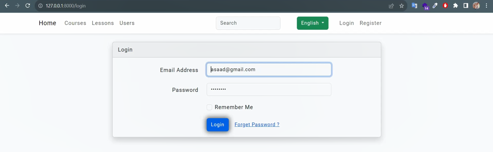

# 🎓 Educational Platform using Laravel

Welcome to the _Educational Platform, a full-featured web application built with [Laravel](https://laravel.com/), **MySQL, **Laravel Sanctum, and \*\*Bootstrap_. This platform provides a flexible learning management system for students, teachers, and administrators.

## 🚀 Features

### 1. Account Management & Authentication

- Register, login, and logout functionality.
- Password reset via email.
- Email verification after registration.

### 🔐 Login Page

---

### 2. Roles and Permissions Management

- Multiple user roles:
  - 👨‍🎓 Student
  - 👨‍🏫 Teacher
  - 🧑‍💼 Admin
- Role-based access control to restrict or grant actions dynamically.

---

### 3. Admin Dashboard

- Add, edit, or delete users.
- Assign roles to users (Student, Teacher, Admin).
- Link users with specific courses based on their role.
- Manage courses, trainings, and sessions.
- Add/edit/delete lectures (title + video or long text).
- Manage users' CV information: job history, certificates, and education levels.

---

### 4. Teacher Dashboard

- Add, update, and remove students from a training.
- Manage sessions: create, edit, delete.
- Mark student attendance for each session using checkboxes.

---

### 5. Student Dashboard

- View assigned courses and their lectures.
- Fill in personal information, education, certificates, and job experience through a CV page.
- Access video lectures or textual content.

---

### 6. Responsive Design & Security

- Fully responsive interface using _Bootstrap_.
- RTL - LTR support for English & Arabic language.
- API endpoints secured via _Laravel Sanctum_ with token-based authentication.

---

## 📸 Screenshots

### 📋 Home Page

### 🎓 Courses Page

### 🎓 Add Course Page

### 🎓 Lessons Page

### 🎓 Edit Lesson

### 🎓 Users Page

### 🎓 CV's Page

---

## ⚙ Installation

1. Clone the repository:
   bash
   git clone https://github.com/your-username/your-repo.git

2) Install dependencies:
   bash
   composer install
   npm install && npm run dev

3. Setup the environment:
   bash
   cp .env.example .env
   php artisan key:generate

4) Configure the database:
   - Create a new MySQL database.
   - Update .env file with database credentials.
   - Run migrations and seeders:
     bash
     php artisan migrate --seed

5. Start the server:
   bash
   php artisan serve

---

## 🔐 API Authentication

This project uses _Laravel Sanctum_ for API authentication.

- To use the protected routes, send your requests with a Bearer Token in the Authorization header.
- Example:

  Authorization: Bearer YOUR_ACCESS_TOKEN

---

## 🛠 Technologies Used

- Laravel 10.x
- MySQL
- Laravel Sanctum (API Authentication)
- Bootstrap 5 (UI Styling)
- JavaScript & Blade Templates

---

## 👨‍💻 Developer

- _Name_: [Asaad Hayani]
- _Email_: [asaad99hayani@gmail.com]
- _GitHub_: [github.com/AsaadHayani]

---

## 📄 License

This project is open-source and available under the [MIT License](LICENSE).
